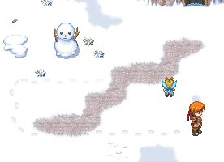

Dynamic Footprints (v 1.0)
===

Footprints are dynamically created for characters moving across tiles (from any tileset) set in the database to have a certain terrain tag (1 by default). For those that wouldn't leave any (e.g. flying characters), it's easy to specify not to leave footprints. Footprints fade away after a user-specified time at a user-specified rate. There shouldn't be any significant impact to framerate.

Features
---
* customizable duration footprint fading (optional)
* direction-specific footprints (optional)
* rounded footprints paths
* overlapping footprints supported
* handles move events (jumping, speed changes, etc) and teleportation

Demo
---
See `demo` directory. Requires RMXP, of course.

Installation
---
Copy the script in `src`, and open the Script Editor within RMXP. At the bottom of the list of classes on the left side of the new window, you'll see one called "Main". Right click on it and select "Insert". In the newly created entry in the list, paste this script.

Usage
---

1. From the database (Tileset tab), give the appropriate tiles of any tilesets that you want to show footprints (e.g. sand in "Desert", snow in "Snow Field") the terrain tag 1.
1. Place the footprints file in the Graphics/Tilesets folder.
 
You use `footprints_default.png` or, if you'd like to make your own, use `footprints_template.png`.

To prevent an event from having any footprints (e.g. birds), include `<nofp>` somewhere in its name.

